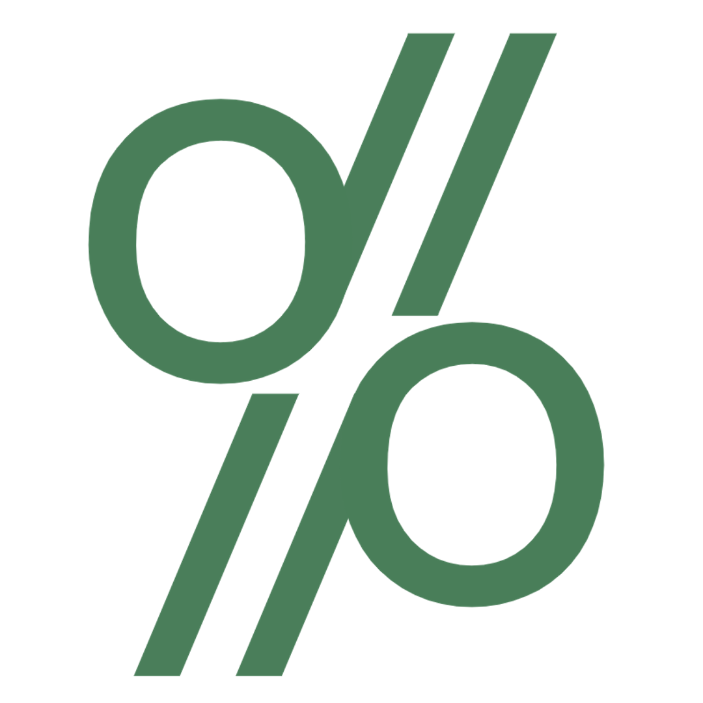

 
  

<h1 align="center"> oddAPI </h1>
<h3 align="center"> An incredibly practical API </h3>  

[![Status][status-shield]][status-url]
[![Practicality][practicality-shield]][practicality-url]
[![Usage][usage-shield]][usage-url]
[![MIT License][license-shield]][license-url]
 

[![Contributors][contributors-shield]][contributors-url]
[![Forks][forks-shield]][forks-url]
[![Stargazers][stars-shield]][stars-url]
[![Issues][issues-shield]][issues-url]
 

<!-- TOC -->
<h2 id="table-of-contents">Table of Contents</h2>

  
Table of Contents

  <ol>
    <li><a href="#about-the-project"> About The Project</a></li>
    <li><a href="#prerequisites"> Prerequisites</a></li>
    <li><a href="#usage"> Usage</a></li>
    <li><a href="#example"> Example</a></li>
    <li><a href="#contributors"> Contributors</a></li>
  </ol>

<!-- ABOUT THE PROJECT -->
<h2 id="about-the-project">About The Project</h2>

[![Size][size-shield]][issues-url]

This project is an open source, cloud-based, representational state transfer Application Programming Interface designed with developers in mind. Streamline your workflow through a remarkably powerful algorithim that has been depended on by thousands of Big Tech companies like Salesforce, Meta, and AOL for decades.
This API is transforming the paradigm of programming itself through its infinitely-scalable, revolutionary design based on the abeyant landscape of
imperative programming. OddAPI aims to provide a bleeding edge, lightweight, and transformative solution for businesses of all sizes, especially those with a big personality! It has been proven to correlate with increased efficency, engagement rates, diversity, and even bandwidth in hundreds of thousands of SaaS, PaaS, DaaS, IaaS, MSaaS, MBaaS, DCaaS, iPaaS, ITMaaS<b>.</b>.<small>.</small><i>(cont.)</i> companies. Simlpy continue below to learn how to leverage this promising and intuitive past, current, and future gen<a href="#Footnote">1</a> service!

<!-- PREREQUISITES -->
<h2 id="prerequisites"> Prerequisites</h2>

[![Python][python-shield]][python-url]
 

These amazing packages are used in this project:
* Flask
* Gunicorn
* Werkzeug

<!-- USAGE -->
<h2 id="usage"> Usage</h2>

This software is not only revolutionary, it's intuitive too!
Simply visit [our API](https://oddapi.herokuapp.com/) to find out more.

<!-- EXAMPLE -->
<h2 id="example"> Example Link</h2>

<b>Is the number 1 odd?</b>  
<a href="https://oddapi.herokuapp.com/1" style="background-color:#3a3f4b;color:white;font-family:Consolas;padding:2px 5px 2px 2px;border-radius:3px">https://oddapi.herokuapp.com/1</a>

<!-- CONTRIBUTORS -->
<h2 id="contributors">Contributors</h2>

  <b>Kunal Jain</b>  
  &nbsp;&nbsp;&nbsp;&nbsp;&nbsp; Email: <a>kunal.jain.1337@gmail.com</a>  
  &nbsp;&nbsp;&nbsp;&nbsp;&nbsp; GitHub: <a href="https://github.com/wherewith">@wherewith</a>  
  &nbsp;&nbsp;&nbsp;&nbsp;&nbsp; GitHub (deprecated): <a href="https://github.com/kuuunal">@kuuunal</a>  

 

<!---FOOTNOTES -->
<h2 id="Footnote">Footnotes</h2>

1. Its just int%2==0

<!-- LINKS & IMAGES -->
[status-shield]: https://img.shields.io/website?down_color=1f363d&down_message=offline&label=API%20status&style=flat-square&up_color=55B4AC&up_message=online&url=https%3A%2F%2Foddapi.herokuapp.com%2F
[status-url]: https://oddapi.herokuapp.com/
[practicality-shield]: https://img.shields.io/badge/practicality%3A-100%25-9cf?color=71AD83&style=flat-square
[practicality-url]: https://upload.wikimedia.org/wikipedia/en/9/9a/Trollface_non-free.png
[usage-shield]: https://img.shields.io/badge/algorithim%20usage%3A-213M-blue?color=71AD83&style=flat-square
[usage-url]: https://www.google.com/search?q=number+of+companies+in+the+world
[license-shield]: https://img.shields.io/github/license/wherewith/oddAPI?color=71AD83&label=license&style=flat-square
[license-url]: https://github.com/wherewith/oddAPI/blob/master/COPYING.txt

[contributors-shield]: https://img.shields.io/github/contributors/wherewith/oddAPI?color=A26CC6&label=cool%20%26%20attractive%20individuals%20%3C3&style=flat-square
[contributors-url]: https://github.com/wherewith/oddAPI/graphs/contributors
[forks-shield]: https://img.shields.io/github/forks/wherewith/oddAPI?color=E67BA9&style=flat-square
[forks-url]: https://github.com/wherewith/oddAPI/network/members
[stars-shield]: https://img.shields.io/github/stars/wherewith/oddAPI?color=E67BA9&style=flat-square
[stars-url]: https://github.com/wherewith/oddAPI/stargazers
[issues-shield]: https://img.shields.io/github/issues-raw/wherewith/oddAPI?color=E67BA9&label=issues&style=flat-square
[issues-url]: https://github.com/wherewith/oddAPI/issues

[size-shield]: https://img.shields.io/github/size/wherewith/oddAPI/main.py?color=55B4AC&label=its%20only&style=flat-square
[python-shield]: https://img.shields.io/badge/made%20with-python-55B4AC?logo=python&logoColor=71AD83&style=flat-square
[python-url]: https://www.python.org/